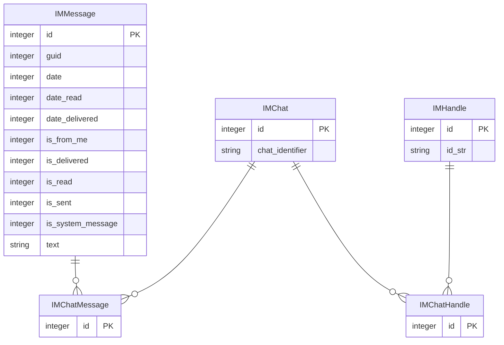

# a_data_home
A data warehouse, I mean home, for all my personal business. Hey big tech, I'll share my models, but hands off my data. 📈🏠❤️


## iMessages

### Setup
1. Restart your Mac in Recovery Mode, open a Terminal, and run `csrutil disable`.  **BE CAREFUL!** This disables System Integrity Protection (SIP) and can expose your system to security risks. Only do this if you understand the implications.
2. Clone this project
3. Edit you `~/.dbt/profiles.yml` file to include the following:
```yaml

imessages:
  outputs:
    dev:
      type: duckdb
      path: /Users/<USERNAME>/imessages_etl/dbt/dbs/dev.duckdb
      threads: 8
      extensions:
        - sqlite
      attach:
        - path: /Users/<USERNAME>/imessages_etl/dbt/dbs/chat.db
          type: sqlite
          alias: imessages
        - path: /Users/<USERNAME>/imessages_etl/dbt/dbs/AddressBook-v22.abcddb
          type: sqlite
          alias: address_book

  target: dev

```
Adjust the `path` above to your where you want to store you iMessages DuckDB file. E.g., `path: /Users/my_name/imessages_etl/imessages.duckdb`
4. From the terminal, enter the `imessages/dbt` folder and Run `dbt deps` to install the dependencies

### Dbt

#### Formatting
- https://medium.com/@alice_thomaz/automating-sql-code-formatting-with-sqlfluff-4723779f19c6


### Useful Links
- https://github.com/my-other-github-account/imessage_tools
- https://github.com/duckdb/dbt-duckdb?tab=readme-ov-file

#### MacOS AttributeBody
- https://apple.stackexchange.com/questions/421665/how-specificially-do-i-read-a-chat-db-file
- https://www.magnetforensics.com/blog/ios-16-what-digital-investigators-need-to-know/
- 

#### MacOS Contacts DB
- https://apple.stackexchange.com/questions/321521/can-i-access-contact-names-in-chat-db
- https://michaelwornow.net/2024/12/24/mac-address-book-schema

### iMessages ERD
