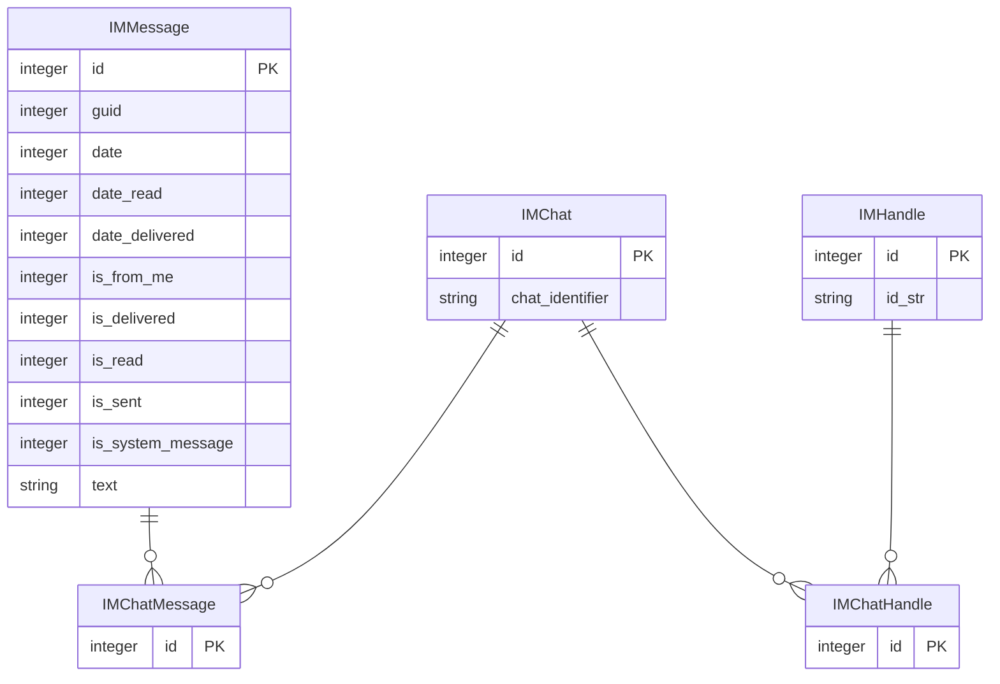

# A Data Home

A data warehouse, I mean home, for all my personal business. Hey big tech, I'll share my models, but hands off my data. 📈🏠❤️

---

## File Structure


```plaintext
.
├── a_data_home
│   ├── analyses
│   ├── dbs
│   ├── dbt_project.yml
│   ├── logs
│   ├── macros
│   ├── models
│   ├── seeds
│   ├── snapshots
│   ├── target
│   └── tests
├── LICENSE
├── logs
│   └── dbt.log
├── poetry.lock
├── pyproject.toml
├── README.md
└── scripts
    ├── decode.py
    └── prepare.py
```

## General Dbt Profile Setup Instructions

To get started with `dbt` and DuckDB:

```yaml
my_data_source:
  outputs:
    dev:
      type: duckdb
      path: /Users/<USERNAME>/my_data_home/dbt/dbs/dev.duckdb
      threads: 8
      extensions:
        - sqlite
      attach:
        - path: /Users/<USERNAME>/path/to/database.db
          type: sqlite
          alias: my_source_alias
  target: dev
```

> Replace `<USERNAME>` and file paths with your actual environment configuration. Use the `attach` section to connect local SQLite databases like iMessages or Contacts.

---

## Data Sources

### iMessages

#### iMessages: Connection Instructions

1. Restart your Mac in Recovery Mode, open Terminal, and run:  
   ```bash
   csrutil disable
   ```  
   ⚠️ **Disables System Integrity Protection. Proceed only if you understand the risks.**

2. Clone this project.

3. Add the following to your `~/.dbt/profiles.yml` file:
   ```yaml
   imessages:
     outputs:
       dev:
         type: duckdb
         path: /Users/<USERNAME>/imessages_etl/dbt/dbs/dev.duckdb
         threads: 8
         extensions:
           - sqlite
         attach:
           - path: /Users/<USERNAME>/imessages_etl/dbt/dbs/chat.db
             type: sqlite
             alias: imessages
           - path: /Users/<USERNAME>/imessages_etl/dbt/dbs/AddressBook-v22.abcddb
             type: sqlite
             alias: address_book
     target: dev
   ```
4. Run `dbt deps` inside the `imessages/dbt` directory.

#### iMessages: ERD



---

### macOS Contacts

#### macOS Contacts: Connection Instructions

- Use the same `dbt` profile entry as above.
- Ensure that the `AddressBook-v22.abcddb` file is available locally and attached as `address_book`.

#### macOS Contacts: ERD


_No full ERD available yet, but see reference links below._

---

## Additional Resources

### Formatting

- SQL formatting: [Automating SQL with SQLFluff](https://medium.com/@alice_thomaz/automating-sql-code-formatting-with-sqlfluff-4723779f19c6)

### iMessage + Contacts Reverse Engineering

- [chat.db breakdown](https://apple.stackexchange.com/questions/421665/how-specificially-do-i-read-a-chat-db-file)
- [iOS 16 Forensics](https://www.magnetforensics.com/blog/ios-16-what-digital-investigators-need-to-know/)
- [Access contact names](https://apple.stackexchange.com/questions/321521/can-i-access-contact-names-in-chat-db)
- [Address Book schema](https://michaelwornow.net/2024/12/24/mac-address-book-schema)

### Tools

- [iMessage Tools Repo](https://github.com/my-other-github-account/imessage_tools)
- [dbt-duckdb Adapter](https://github.com/duckdb/dbt-duckdb?tab=readme-ov-file)
